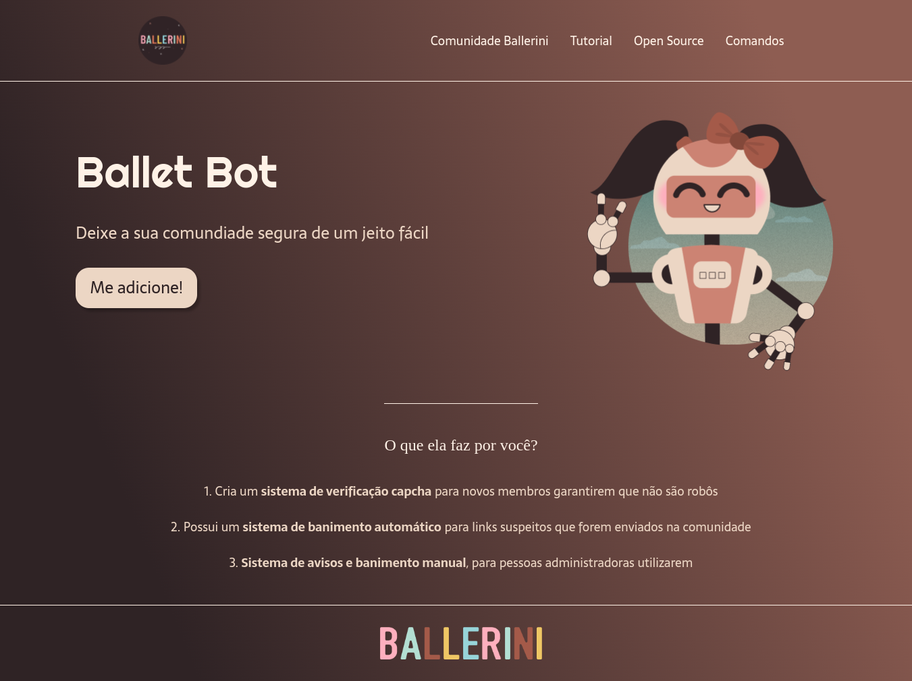

# Landing Page BALLETBOT 

Construi o projeto com o objetivo de testar as minhas habilidades em HTML e CSS Flexbox. Se trata de uma landing page de um bot para comunidades no Discord.

Este também foi o meu primeiro repositório do GitHub.

- *A landing page balletbot foi inspirada pela [Rafaella Ballerini](https://youtu.be/llF6vD-RljE)*

Clique [aqui](https://e-mendesjr.github.io/landingpage-balletbot/) para visualizar a página.
